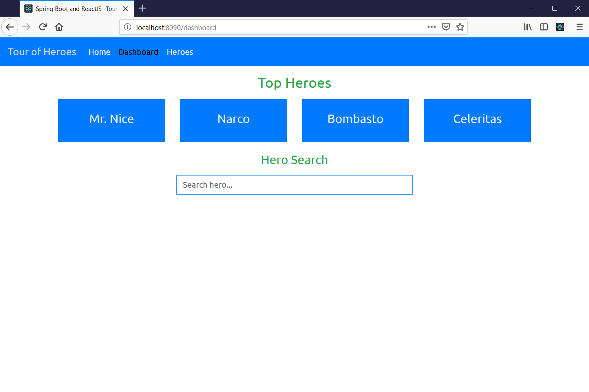
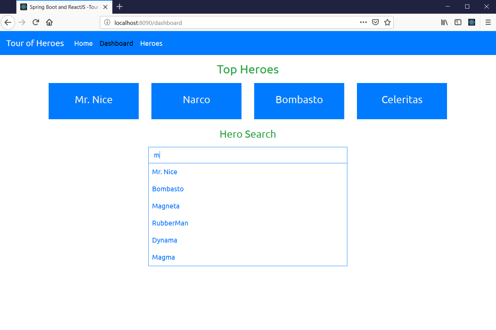
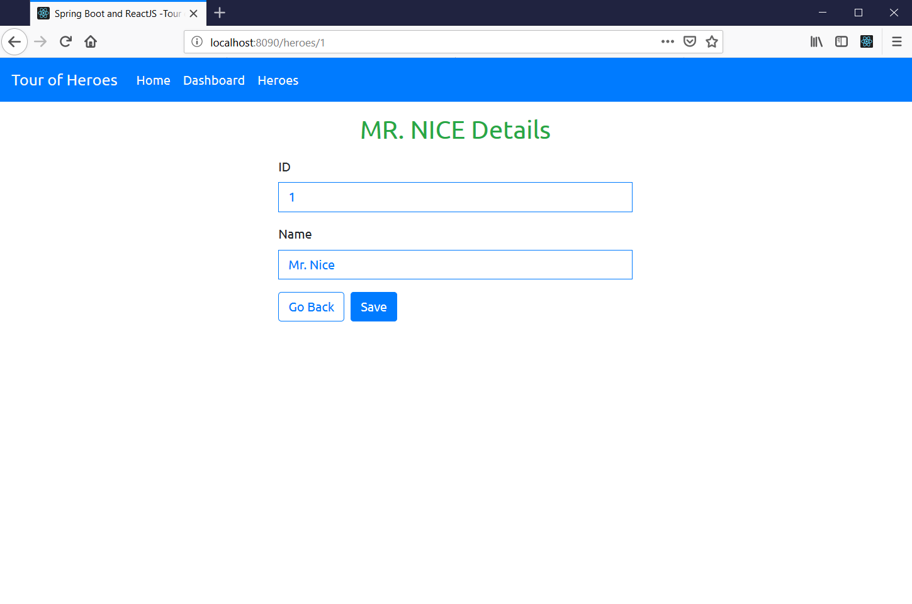
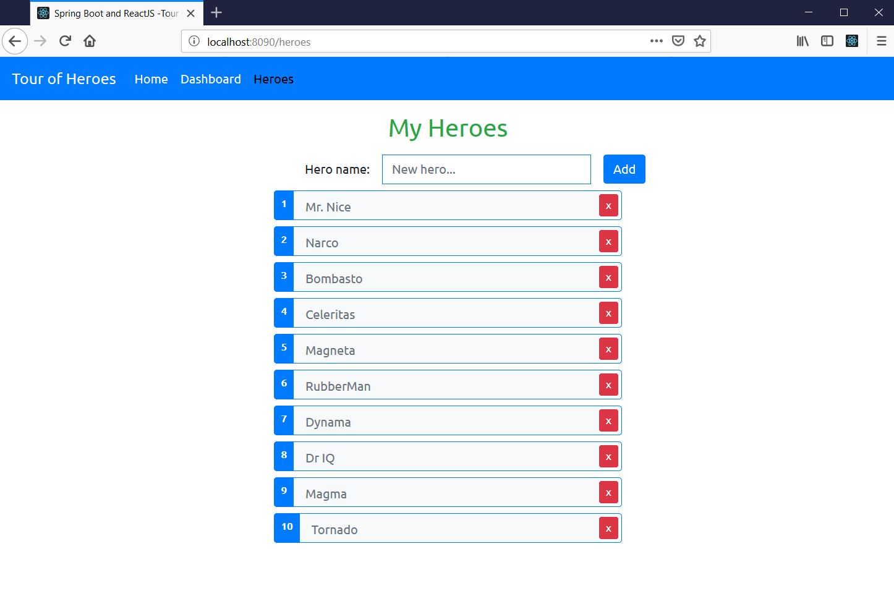

# spring-boot-and-reactjs
Spring Boot and ReactJS application based on Google's Angular Tour of Heroes application.

## Clone
```
git clone https://github.com/julianjupiter/spring-boot-and-reactjs
```
## Build and Run
 - Windows
 ```
 .\mvnw.cmd package
 java -jar .\target\spring-boot-and-reactjs-0.0.1-SNAPSHOT.jar
 ```
 - GNU/Linux, UNIX
 ```
 ./mvnw package
 java -jar ./target/spring-boot-and-reactjs-0.0.1-SNAPSHOT.jar
 ```
## Screenshots
### Home/Dashboard

### Search

### Detail

### List/Add
